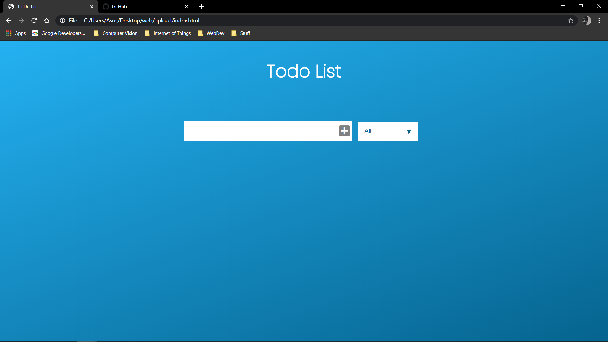
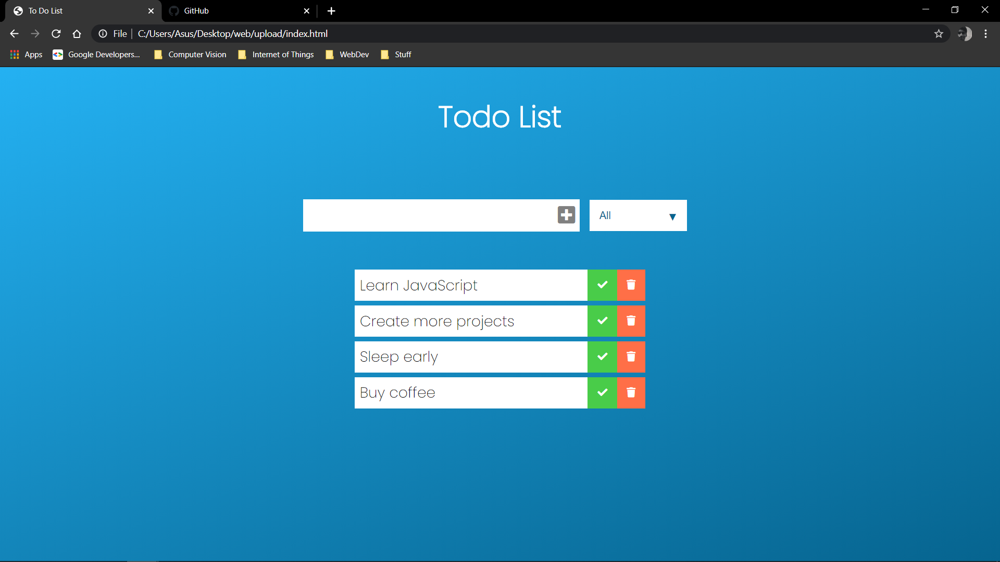
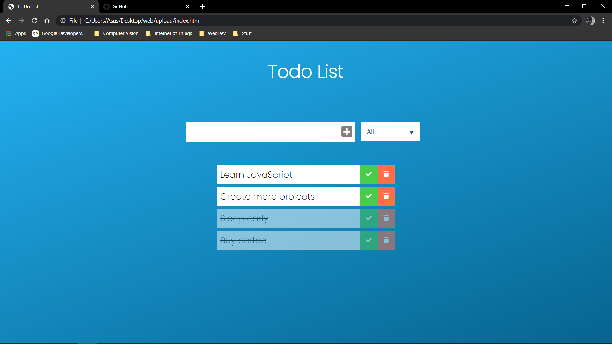

# To-Do-List-WebApp
A basic To Do List Web Application designed with JavaScript, CSS and HTML. Getting to know basics of JavaScript through development.

## Basic Layout

## List 

## Checked items

References and tutorials - [DevEd](youtube.com/deved)
